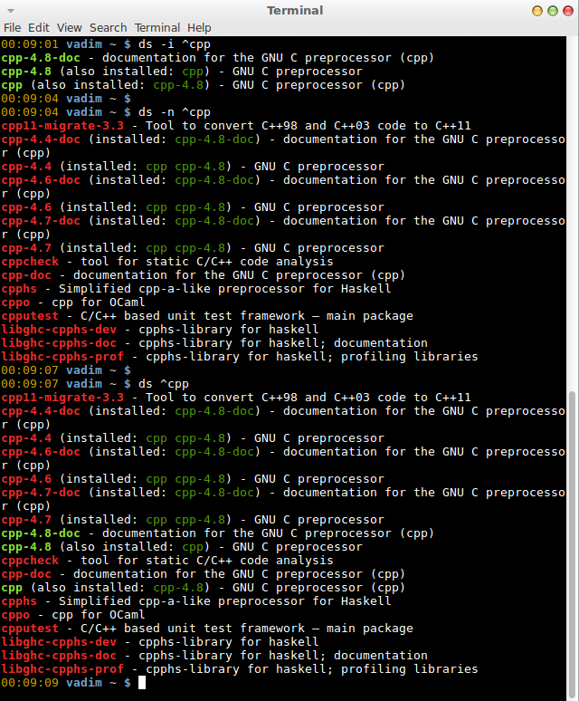

ds: dpkg search
=======

ds is a simple utility that allows one to search for installed and available packages.

Usage
===

Options:

    -a (default)    search all packages (apt-cache search)

    -i              search installed packages (dpkg -l)

    -n              search not installed packages only (apt-cache search not in dpkg -l)

Screenshot
===

